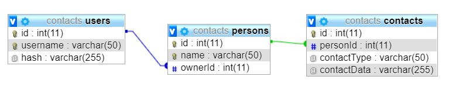

# AlgebraContacts2019
Potrebno je napraviti aplikaciju koja pohranjuje korisničke kontakte te dopušta pregled istih. Svaka unesena osoba može imati više kontakata.

## Aplikacije mora podržavati:
* Stvaranje korisničkog računa
* Prijavu registriranog korisnika
* Promjenu zaporke trenutno prijavljenog korisnika
* Odjavu korisnika
* Pregled kontakata na poslužitelju
* Dodavanje nove osobe
* Dodavanje novog kontakta osobe
* Izmjenu pojedinačnog kontakta osobe
* Brisanje kontakta osobe odnosno svih kontakata osobe i same osobe

